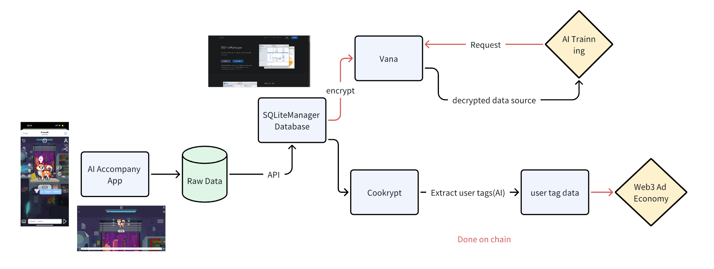

## Kryptopany - Bethink Hackathon Final Project

This project is divided into three parts:
- The `accompany_app`. It's the data source of our economy. The data generated from the user and the AI's dialogue can be used to train AI model, as well as extract user personal tags.
- The `crypt` is the backend of AI tags extract process.
- `bethink-ui` The built frontend for display the vana data handling process

## Description

We get chat history from AI companion App. The data then has 2 flow
- Encrypted with Vana DLP, verified by vana validator and published for AI training. Pay a certain number of token, then the data can be decoded
- Input for extract user personal tags, the data source for Advertising business.

## How the system work

### Crypt

### Vana

